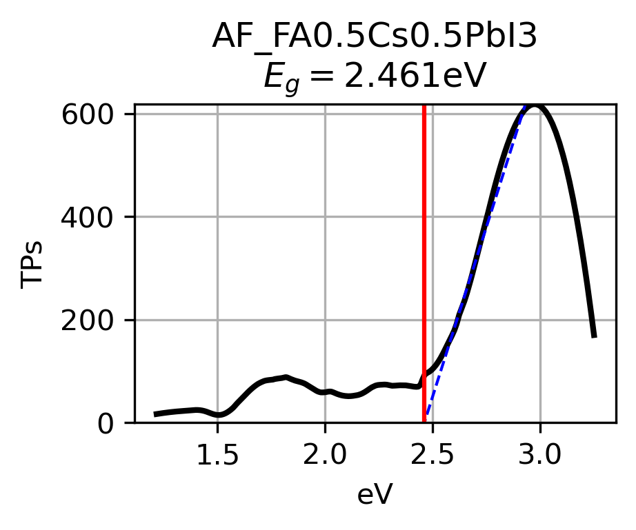
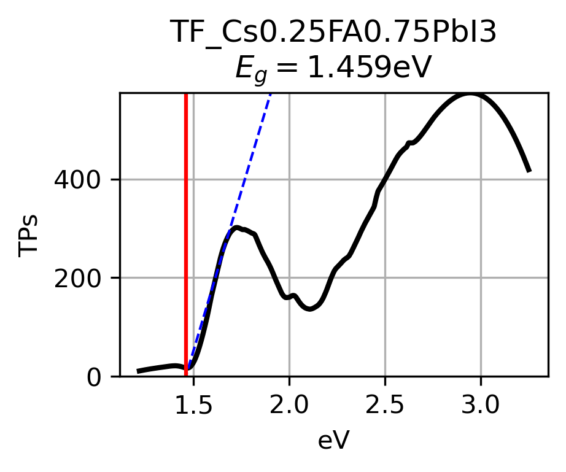
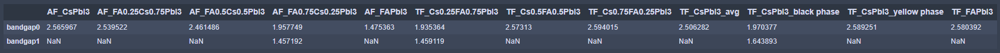

# Automatic-Band-Gap-Extractor

Author: Alexander (Aleks) E. Siemenn \<asiemnn@mit.edu\>

Date:   05 Feb. 2023

# Table of Contents
- [How to Cite](#how-to-cite)
- [Package Description](#description)
- [Installation](#installation)
- [Usage](#usage)

# How to Cite

If you use this package for your research, please cite the following paper:

**Citation:** 

    @article{,
    author = {},
    title = {},
    journal = {},
    volume = {},
    number = {},
    pages = {},
    year = {},
    doi = {},
    URL = { 

            }}

# Description:

This package automatically extracts the band gap from an array of multiple measured reflectance spectra samples.

**Steps for Extracting Band Gap:**

- Compute Tauc plots from reflectance for each spectra.
- Each Tauc plot is smoothed using a Savitzky–Golay filter to reduce signal noise.
- The smoothed curves are processed into line segmented using a recursive segmentation process. This process segmements the smoothed curve in half recursively into smaller line segments until each line segment has a fit of $R^2 \geq 0.990$ with its respective curve segment.
- The peak locations of the Tauc plot are extracted after an extreme Savitzky–Golay smoothing filter is applied to locate the upper-bound for linear regression fitting in the next step.
- A linear regression across the entire Tauc plot range is fit for every n and n+1 pair of line segments. The regression lines that have a positive slope, intersect with the x-axis, and have the lowest RMSE with the Tauc plot between the x-intercept and the next Tauc plot peak are the regression lines used to compute band gap.
- Band gaps are extracted from the x-intercepts of the regression lines computed in the previous step.

# Installation

Package installation requirements can be found in the [requirements.txt](./requirements.txt) file.

# Usage

A demonstration of using the automatic band gap extractor package can be found in the [example.ipynb](./example.ipynb) file. The automatic band gap extractor code itself can be found in the [extractor.py](./extractor.py) file under the `autoextract()` definition.

Input data should take the form of an (n x m) pandas array with n reflectance data points and (m - 1) measured spectra, where m = 0 is the wavelength. Below is an example of the input data format with 12 measured reflectance spectra and the wavelength values in the m = 0 column:

Spectra with only a single peak will output a single band gap value based on the linear regression fit:

However, spectra with more than one clear peak will output multiple band gap values, one for each peak based on the linear regression fit:
|  |  |

If there are multiple band gap values extracted for a single spectra, the band gap associated with the highest intensity peak signal will be output first as `bandgap0` and the following band gaps will follow this pattern. Images illustrating the Tauc plot, regression fit, and band gap will be saved to the `savepath` location specified by the variable in the `autoextract(savepath=)` definition. In this path, a csv file of extracted band gaps will be saved with the following format:

